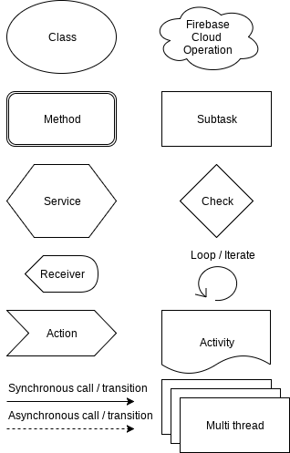
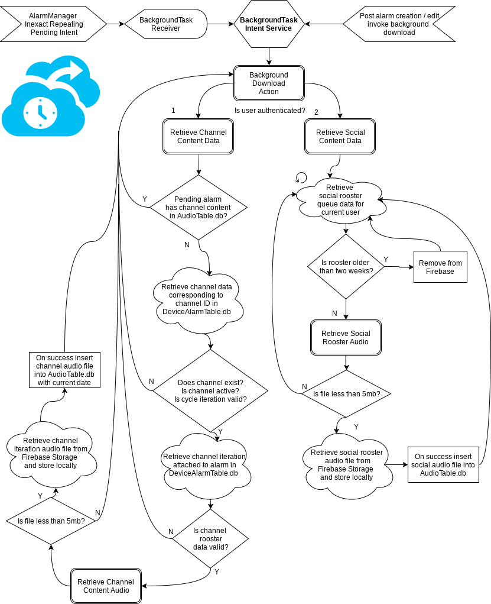
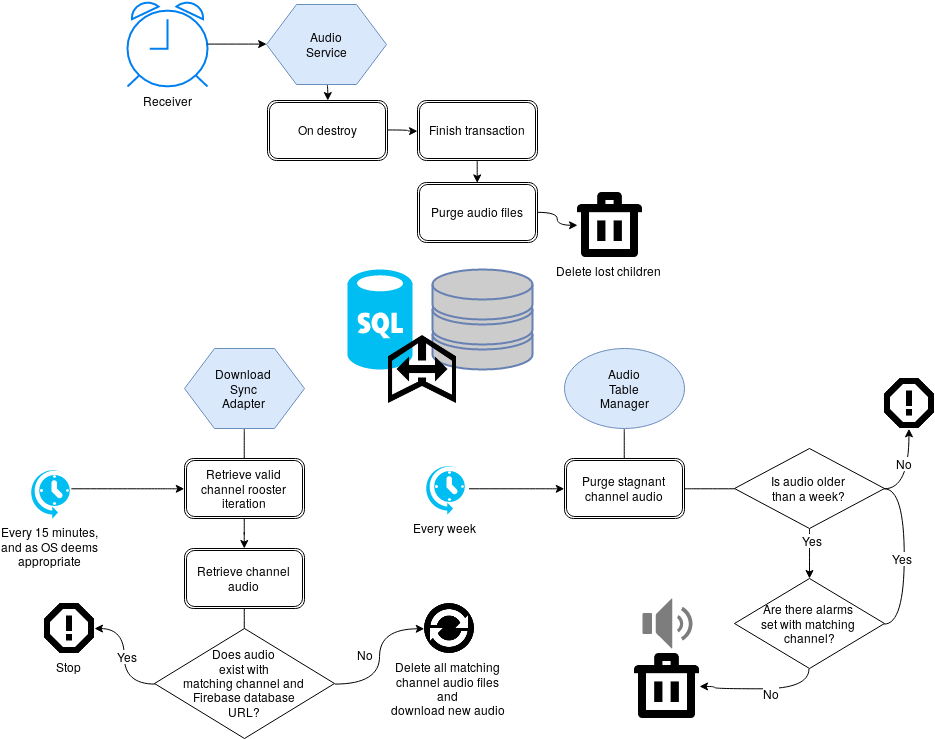
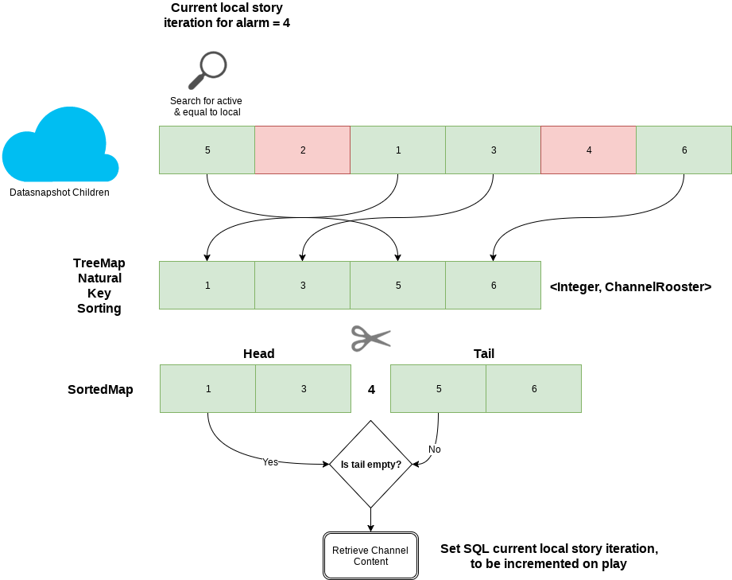
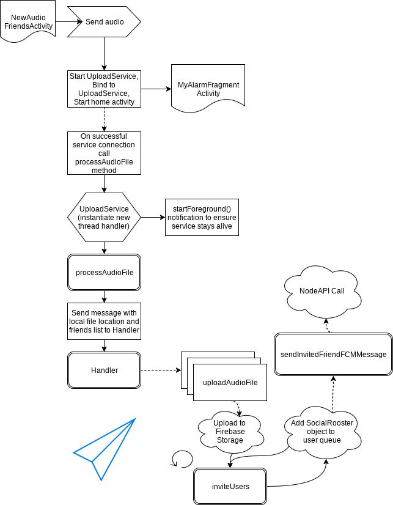
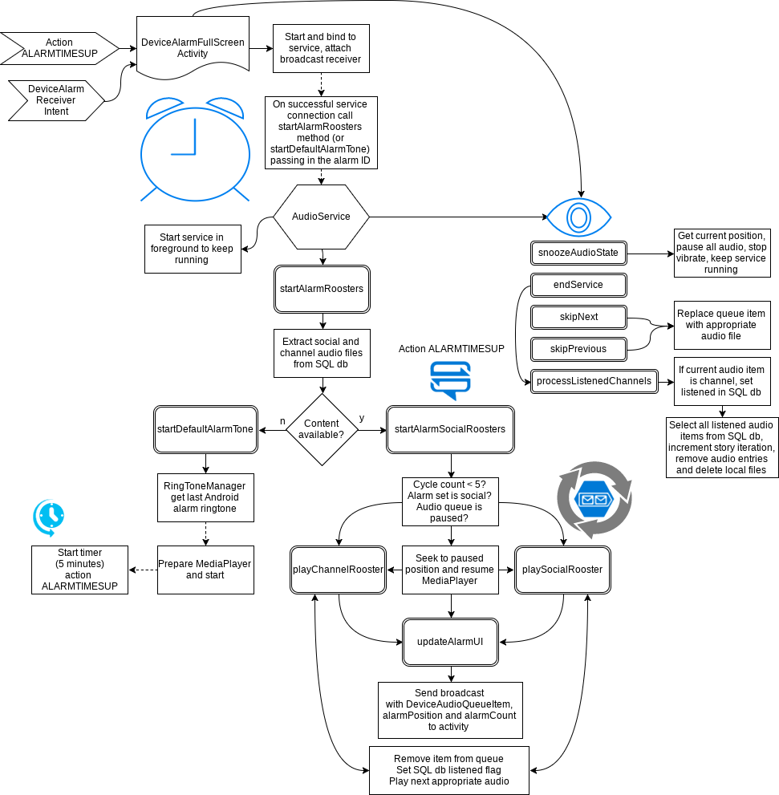
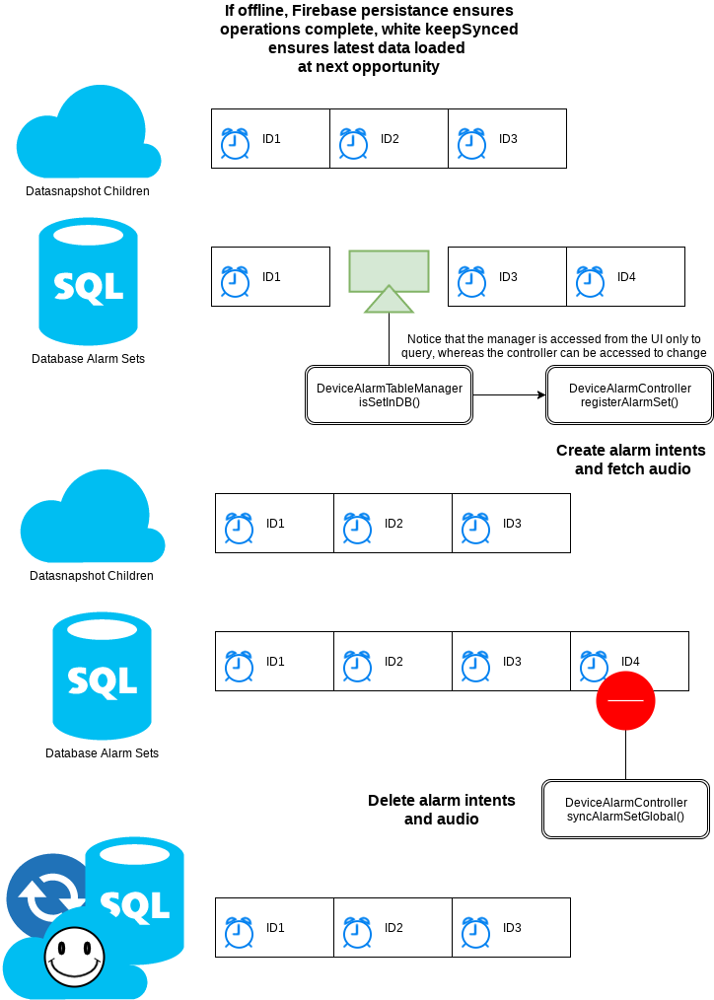
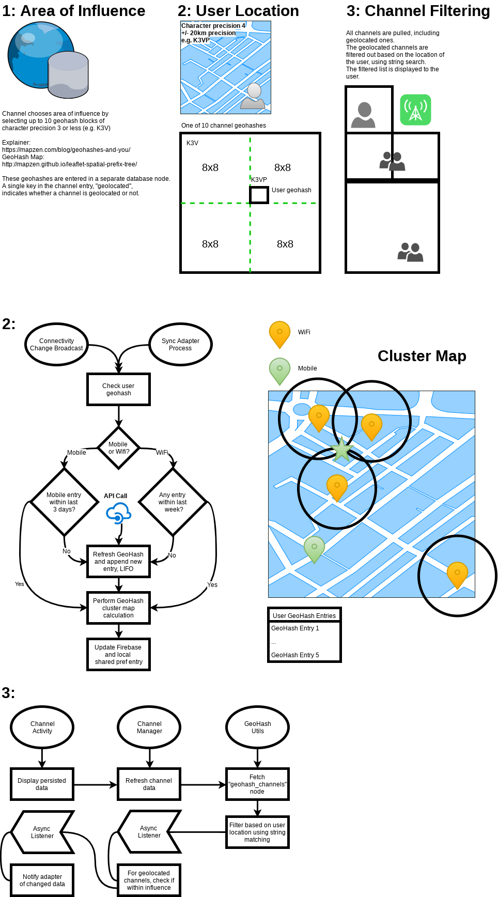

# Rooster Android Application Documentation
# Project Overview / Structure

## General

##### BaseApplication
##### Constants
*Constants* is a public class that holds public static final variables, for both configuration and utility. 

The following are examples of constants kept here:
+ Intent actions and extras
+ IntentFilter actions
+ BroadcastReceiver actions
+ Notifications IDs
+ BaseApplication flags

##### Domain
##### Dagger

## UI / UX

### Activity
#### BaseActivity
### Fragment
#### BaseFragment
### Adapter
### Resources

## Backend

### SQL Databases
##### Contract
##### Helper
##### Manager
##### Controller

#### AudioTable.db
#### DeviceAlarmTable.db

### BroadcastReceiver
>Base class for code that receives and handles broadcast intents sent by sendBroadcast(Intent).

>You can either dynamically register an instance of this class with Context.registerReceiver() or statically declare an implementation with the <receiver> tag in your AndroidManifest.xml.

#### BootReceiver
When the Android device is rebooted, any applications that have the *RECEIVE_BOOT_COMPLETED* permission and a receiver that implements the intent filter action *android.intent.action.BOOT_COMPLETED* will invoke the corresponding *BootReceiver* class that extends *BroadCastReceiver*. 

The *BootReceiver* instantiates a *DeviceAlarmController* object and calls the *rebootAlarms()* method. This method checks the persistant *DeviceAlarmTable* SQLite database for any enabled alarms and refreshes them - this recreates the aprropriate AlarmManager pending intents using the *DeviceAlarmController* *setAlarm()* method. 

The *BootReceiver* is also responsible for calling the *BackgroundTaskReceiver's* intent scheduling methods.

#### BackgroundTaskReceiver
The *BackgroundTaskReceiver*, using the BroadCastReceiver *onReceive()* method, receives an intent and starts a service with an attached action. 

The scheduling (and cancelling) of the pending intents is performed using methods of this class. The AlarmManager service is used to create an inexact repeating intent at a set time interval. The action of this intent is sent to the *BackgroundTaskIntentService* for processing.

#### DeviceAlarmReceiver
The *DeviceAlarmReceiver* receives intents set by the *DeviceAlarmController* using the Android AlarmManager. 

The following extras are processed by the receiver:
+ **EXTRA_UID** - the UID of the current alarm set 
+ **EXTRA_RECURRING** - boolean indicates whether alarm intent should be recreated a week later, or set to disabled
+ **EXTRA_VIBRATE** - boolean indicates whether android Vibrator service should be started
+ **EXTRA_TONE** - boolean indicates whether a default alarm tone was selected during alarm creation rather than social or channel content (not currently used)

The following extras are sent to the DeviceAlarmFullScreenActivity:
+ **DEVICE_ALARM_RECEIVER_WAKEFUL_INTENT** - Intent object that allows activity to call *completeWakefulIntent()* method
+ **EXTRA_UID** - the UID of the current alarm set, used to attach appropriate channel content to alarm and to send to *AudioService*

### Service
#### BackgroundTaskIntentService 
As described in the Diagrams section, the *BackgroundTaskIntentService* handles all periodic background tasks. 

General methods exist for managing the reception of intent actions and manual triggering of service tasks:
+ **Start methods** - called during special cases where the task should be run immediately, such as the *handleActionBackgroundDownload()* task after an alarm has been set or edited
+ **onHandleIntent()** - @Override method that receives service intents and processes the attached actions, to trigger one of the action handlers
+ **Action handlers** - call the necessary methods to complete the task
+ **Task methods** - methods called by the action handlers

The background tasks that the BackgroundTaskIntentService handles are:
+ **handleActionBackgroundDownload()** - retrieve channel and social audio data
+ **handleActionDailyTask()** - perform admin tasks run daily such as purging old audio files
+ **handleActionMinuteTask()** - perform update tasks run by the minute such as updating received rooster count and displaying badge notifications (the *FirebaseListenerService* is triggered by this action)

#### AudioService

#### UploadService

## Cloud

### NodeAPI
### Firebase

# Diagrams


## Background audio caching task -- Deprecated


## Audio syncing process
Updated 24 July 2017:


## Channel story algorithm


## Social rooster upload process


## Audio service


## Alarm syncing process -- Deprecated


## Geolocation Protocol



# Android Release Procedure

## GIT repository management

Two branches have been created to seperate beta and release versions of the app, namely: "beta" & "release".

**Beta branch**
All cowboy hat development must be done on this release. Once the necessary test procedures have been performed, and the changes reviewed, then it can be merged to the release branch before final testing.

**Release branch**
The release branch must be thouroughly tested before being released onto the Play Store, with the following broad test procedures:

* Brute force testing: primarily setting alarms (logout, login, syncing, downloads, offline, reboot, etc.)
* Navigation testing: Ensure backstack doesn't cause issues with lost data between transitions causing unexpected behaviour
* Internet service testing: Ensure combinations of online and offline behaviour don't cause problems, specifically: alarm
* Firebase robot testing: Run multiple tests to investigate: screen size, visual changes, navigation issues, hardware issues (alarm and backend unlikely to be tested)
* Reboot testing: Ensure app behaves correctly after boot receiver triggered, and ensure proper authentication occuring

**Commit messages**
Changes must be made incrementally on the beta branch, with commit messages detailing the changes in each module/class of the app. 

## Versioning

All Android Rooster releases have a version name, and a version code, formatted as follows:
> Version name: "2.0.0" where the three elements represent major, minor, and "bug fix" releases respectively
> Version code: (int) an integer used for build releases on the Play Store, where every new release must have a greater version code to differentiate it from previous releases

The formatting of the version name is incredibly important, as it is processed and used to decide whether the app needs a force update or not, with the comparison being made to the "minimum_requirements" node in Firebase (read only, non authenticated).

### Version Codes
**Warning: The greatest value Google Play allows for versionCode is 2100000000.** 

For beta version: xxx 1 XXX XXX 
eg. 1000000, 1000001, ...
For release version: xxx 0 XXX XXX 

### Version Names
Formatting of version name very important for app version invalidation, must have 3 components seperated by period.
The beta version name is the release version name at point of diversion, with alpha b appended.
eg. versionName "2.1.12b" 

Beta is in active release. When commiting on beta branch, use "vX.X.Xb:" as indicator of an update pushed to Play store - no need to change version name, but increment version code.

## Migration from Beta to Release branch

In future - when beta merged with release, ensure gradle build files updated as well as manifest (icon and name links). The beta version of the app has a different name, as well as a different icon.

## Release key APK signing

The current version 2.0.0b apk-key.jks file for signing is located in the rooster-anroid repo on Bitbucket: apk-key-release/ - this may change in future once the project brings on more team members... in which case the original creator of the key is Benjamin Scholtz, the key being stored in KeePassX.

The current APK key, apk-key.jks, is stored in the secrets folder in the repo https://BenjaminScholtz@bitbucket.org/BenjaminScholtz/androidsecrets.git and not in the project bitbucket group. This is for added security. 

As a Linux computer user, the following setup allows secure automated APK key signing without keeping the key file in the project folder:

* First configure your build process to automatically sign your APK with the existing keystore file
https://developer.android.com/studio/publish/app-signing.html


```
signingConfigs {
    config {
        storeFile file(String.valueOf(System.getenv("KEYSTORE")))
        storePassword System.getenv("KEYSTORE_PASSWORD")
        keyAlias System.getenv("KEY_ALIAS")
        keyPassword System.getenv("KEY_PASSWORD")
    }
}

android {
    buildTypes {
        release {
        ...
        signingConfig signingConfigs.config
        ...
        }
    }
}
```

* Store your environment variables in .bashrc

    
Consider using https://rtyley.github.io/bfg-repo-cleaner/ to remove APK key history from Git repo:

```
bfg --delete-folders ... --delete-files ..  --no-blob-protection  my-repo.git
git reflog expire --expire=now --all && git gc --prune=now --aggressive
```

This was messy, maybe don't :P

## Firebase setup

In order to setup Firebase Analytics and Crash Reporting in the Android app, an instance of FirebaseAnalytics needs to be acquired. To ensure that issues in the debug version of the app are not reported, place the setAnalyticsCollectionEnabled(false) method in a conditional statement.

```
//Get static FBAnalytics instance
firebaseAnalytics = FirebaseAnalytics.getInstance(this);
if(BuildConfig.DEBUG) {
    firebaseAnalytics.setAnalyticsCollectionEnabled(false);
}
```

### Firebase functions
To deploy, use: firebase deploy --only functions
Ensure that the firebase database rules are up to date before deploying, otherwise they may be overwritten with current implementation.

## Fabric Crashlytics setup

The Fabric API key must be kept in the android manifest and a fabric.properties file must exist in the project app root.

```
<meta-data
android:name="io.fabric.ApiKey"
android:value="__REMOVED__" />
```

The following CrashlyticsCore Builder method enables us to disable reporting during debug, much like we did above for Firebase crash reporting.

```
//Activate crashlytics instance
CrashlyticsCore core = new CrashlyticsCore.Builder().disabled(BuildConfig.DEBUG).build();
Fabric.with(this, new Crashlytics.Builder().core(core).build());
```

## Facebook API setup

The Facebook API key must be set up in the android manifest. It is stored in config.xml. 

```
<meta-data
android:name="com.facebook.sdk.ApplicationId"
android:value="@string/facebook_app_id" />
```

In application class:

```
//Activate facebook app connection
AppEventsLogger.activateApp(this, getResources().getString(R.string.facebook_app_id));
```

It is important to note that the API key will need to change if the APK key changes and hence the hash of the APK.

To get the APK hash key needed to configure the Facebook API key from the Facebook developer console, use the following method on release signed version of app:

```
PackageInfo info;
try {
    info = getPackageManager().getPackageInfo("com.your.project.package", PackageManager.GET_SIGNATURES);
    for (Signature signature : info.signatures) {
        MessageDigest md;
        md = MessageDigest.getInstance("SHA");
        md.update(signature.toByteArray());
        String something = new String(Base64.encode(md.digest(), 0));
        //String something = new String(Base64.encodeBytes(md.digest()));
        Log.e("hash key", something);
    }
} catch (PackageManager.NameNotFoundException e1) {
    Log.e("name not found", e1.toString());
} catch (NoSuchAlgorithmException e) {
    Log.e("no such an algorithm", e.toString());
} catch (Exception e) {
    Log.e("exception", e.toString());
}
```

This will output the hash key to the Android Monitor. The "keytool" does not output the correct hash key for some reason. Otherwise, try login using Facebook from Rooster and it will output the hash key saying it does not exist, then add this hash key in the Facebook developer console.

## Google API setup

Authenticating your client:
https://developers.google.com/android/guides/client-auth

In Android Studio, go to Gradle toolbar on right hand side - under your project, click Tasks->android->signingReport. Double click the signingReport to generate your SHA1 certificate.

The google-services.json file is then setup and downloaded from the Google console.

From version 3.0.0, you can have google-services.json for different build types: under app/src/flavor/... & app/src/flavor/debug/...

http://stackoverflow.com/questions/30772201/google-services-json-for-different-productflavors

## Node API setup

Node uses retrofit to manage API calls. Retrofit must be set up in application class as follows, with the Node API url stored in config.xml:

```
//Create Retrofit API class for managing Node API
mRetrofit = new Retrofit.Builder()
        .baseUrl(getResources().getString(R.string.node_api_url))
        .addConverterFactory(GsonConverterFactory.create())
        .build();
mAPIService = mRetrofit.create(IHTTPClient.class);
```

## Database and API rerouting


## Proguard and Minification

Progaurd rules:
https://developer.android.com/studio/build/shrink-code.html

After configuring the custom rules, add to build.gradle config:

```
buildTypes {
    release {
        ...
        proguardFiles getDefaultProguardFile('proguard-android.txt'), 'proguard-rules.pro'
        consumerProguardFiles 'proguard-rules.txt'
        proguardFile 'proguard-square-okio.pro'
        proguardFile 'proguard-square-retrofit.pro'
        proguardFile 'proguard-square-retrofit2.pro'
        proguardFile 'proguard-square-dagger.pro'
        proguardFile 'proguard-square-okhttp.pro'
        proguardFile 'proguard-square-picasso.pro'
        proguardFile 'proguard-support-v7-appcompat.pro'
        ...
    }
}
```

### Custom rules

Square Retrofit and Square Okio require custom .pro file from:
https://github.com/krschultz/android-proguard-snippets

When using POJO object mapping classes (for example in Firebase database object mapping), use "@Keep" annotation or proguard rule, as below, to ensure getters and setters are not optimized and deleted from class:

```
-keep public class com.roostermornings.android.domain.**
```

**Firebase proguard rules**
https://firebase.google.com/docs/database/android/start/

Add to proguard-rules.pro:

```
# Add this global rule
-keepattributes Signature

# This rule will properly ProGuard all the model classes in
# the package com.yourcompany.models. Modify to fit the structure
# of your app.
-keepclassmembers class com.roostermornings.android.domain.** {
  *;
}
```

All Firebase object mapping classess must also have public variables for release:
http://stackoverflow.com/questions/37743661/firebase-no-properties-to-serialize-found-on-class

**Firebase proguard mapping files**

https://console.firebase.google.com/project/roosta-media/settings/serviceaccounts/crashreporting
https://firebase.google.com/docs/crash/android

Add FirebaseServiceAccountFilePath = /roosta-media-firebase-crashreporting-qeewh-ce8f6db004.json to gradle.properties in project root.

Use setProperty("FirebaseServiceAccountFilePath", rootProject.rootDir.absolutePath + FirebaseServiceAccountFilePath) in build.gradle. 

The following command, run from project root, is run automatically during a release build, and uploads the necessary mapping files to Firebase: 

```
./gradlew :app:firebaseUploadReleaseProguardMapping
```

## Testing Procedures 

### Doze Mode

https://developer.android.com/training/monitoring-device-state/doze-standby.html

## Debug of Release

Set 'debuggable true', and 'minifyEnabled false' temporarily in build.gradle buildTypes->release, to get proper stacktraces and allow debugging. Debug as usual from Android Studio.

## Final Release

Set 'debuggable false', and 'minifyEnabled true' in build.gradle buildTypes->release.

From project root run ./gradlew assembleRelease --info && ./gradlew installRelease, or if you're Yoda, run rooster-android-assemble bash script from home directory bin folder which does a two step assemble followed by install process.


